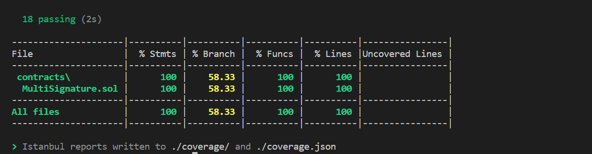

### Prerequisites

- npm

  ```sh
  npm install npm@latest -g
  ```

### Installation

1. Clone the repo

   ```sh
   git clone https://github.com/salaimuniselvam-s/iNeuron.git
   ```

2. Install NPM packages

   ```sh
   npm install
   ```

### Usage

1. To run test

   ```sh
   npm run test
   ```

2. To check the test coverage

   ```sh
   npm run coverage
   ```

### Test Coverage

   
